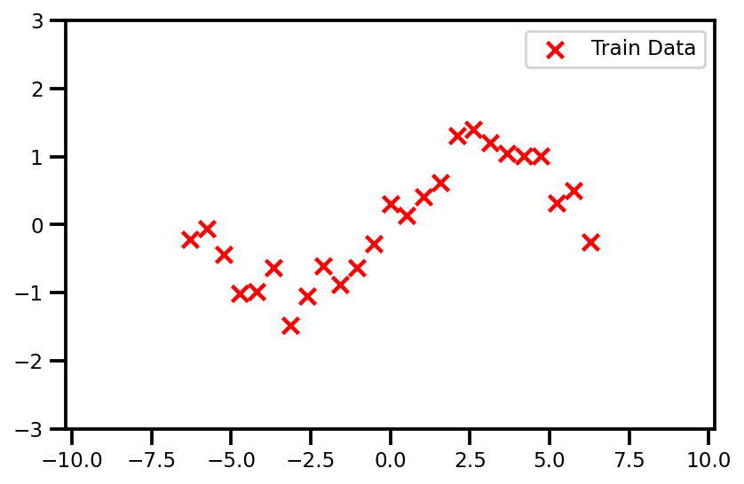
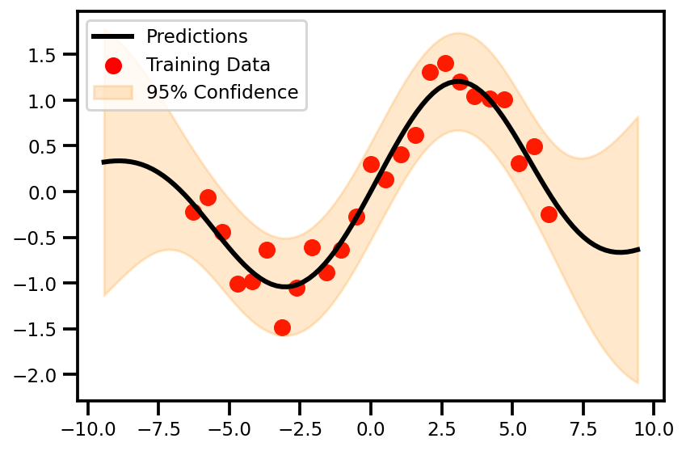
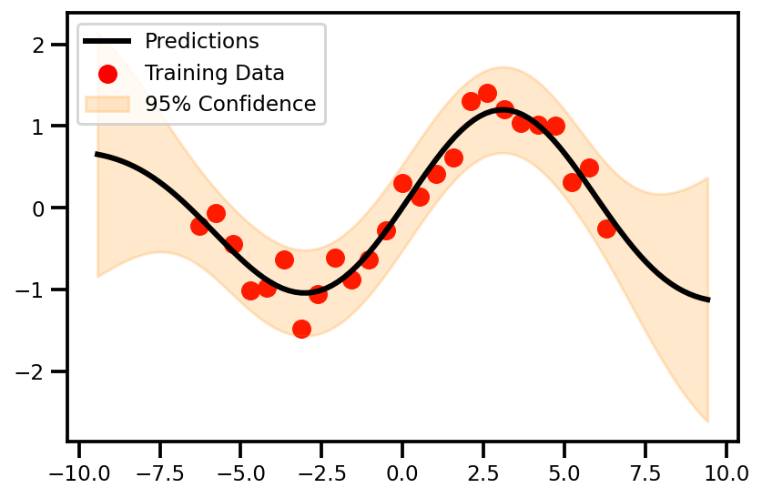
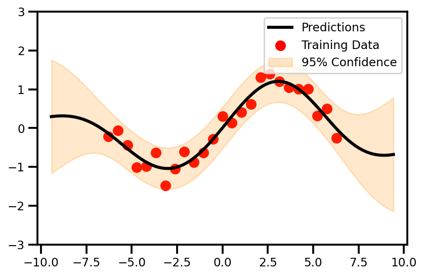

# 1D Example Walk-through

!!! info "Colab Notebooks"

    <center>

    |     Name     |                                                                           Colab Notebook                                                                            |
    | :----------: | :-----------------------------------------------------------------------------------------------------------------------------------------------------------------: |
    | scikit-learn | [](https://colab.research.google.com/drive/1vbDP0vtILN6-FLO_kHOyebSMHeOYR5Y1?usp=sharing) |
    |    GPFlow    | [](https://colab.research.google.com/drive/1_ip2kWmp344GC76Dj7IX3vYfTZsz-S-S?usp=sharing) |
    |   GPyTorch   | [](https://colab.research.google.com/drive/15o9-BWW98fP6corLWOew5a0sZq-_3Yvl?usp=sharing) |

    </center>

This post we will go over a 1D example where I show how one can fit a Gaussian process using the [scikit-learn](), [GPFlow]() and [GPyTorch]() libraries. Each of these libraries range in complexity with scikit-learn being the simplest, GPyTorch being the most complicated and GPFlow being somewhere in between. For newcomers, it's good to see the differences before making your decision.

In this demo, we will do a small data problem; just 25 samples. This is where a GP tends to excel because of 

---

## Data

The way we generate the data will be the same for all packages. Here is the code and demo data that we're working with; 


??? code "Code"

    ```python
    # control the seed
    seed = 123
    rng = np.random.RandomState(seed)

    # Generate sample data
    n_samples = 25

    def f(x):
        return np.sin(0.5 * X)

    X = np.linspace(-2*np.pi, 2*np.pi, n_samples)
    y =  f(X) + 0.2 * rng.randn(X.shape[0])

    X, y = X[:, np.newaxis], y[:, np.newaxis]

    plt.figure()
    plt.scatter(X, y, label="Train Data")
    plt.legend()
    plt.show()
    ```

<center>
{: loading=lazy }
</center>

---

## GP Model

??? code "Scikit-Learn"

    In `scikit-learn` we just need the `.fit()`, `.predict()`, and `.score()`.

    First we need to define the parameters necessary for the gaussian process regression algorithm

    
    ```python linenums="1"
    from sklearn.gaussian_process import GaussianProcessRegressor
    from sklearn.gaussian_process.kernels import RBF, WhiteKernel, ConstantKernel

    # define the kernel
    kernel = ConstantKernel() * RBF() + WhiteKernel()

    # define the model
    gp_model = GaussianProcessRegressor(
        kernel=kernel,          # Kernel Function
        alpha=1e-5,             # Noise Level
        n_restarts_optimizer=5  # Good Practice
    )
    ```

??? code "GPFlow"

    **Mean & Kernel Function**
    
    So GPflow gives us some extra flexibility. We need to have a all the moving parts to define our standard GP.

    ```python linenums="1"
    from gpflow.mean_functions import Linear
    from gpflow.kernels import RBF

    # define mean function
    mean_f = Linear()
    
    # define the kernel
    kernel = RBF()
    ```

    **GP Model**

    ```python linenums="1"
    from gpflow.models import GPR

    # define GP Model
    gp_model = GPR(data=(X, y), kernel=kernel, mean_function=mean_f)

    # get a nice summary
    print_summary(gp_model, )
    ```

    ```bash
    ╒═════════════════════════╤═══════════╤══════════════════╤═════════╤═════════════╤═════════╤═════════╤═════════╕
    │ name                    │ class     │ transform        │ prior   │ trainable   │ shape   │ dtype   │ value   │
    ╞═════════════════════════╪═══════════╪══════════════════╪═════════╪═════════════╪═════════╪═════════╪═════════╡
    │ GPR.mean_function.A     │ Parameter │ Identity         │         │ True        │ (1, 1)  │ float64 │ [[1.]]  │
    ├─────────────────────────┼───────────┼──────────────────┼─────────┼─────────────┼─────────┼─────────┼─────────┤
    │ GPR.mean_function.b     │ Parameter │ Identity         │         │ True        │ (1,)    │ float64 │ [0.]    │
    ├─────────────────────────┼───────────┼──────────────────┼─────────┼─────────────┼─────────┼─────────┼─────────┤
    │ GPR.kernel.variance     │ Parameter │ Softplus         │         │ True        │ ()      │ float64 │ 1.0     │
    ├─────────────────────────┼───────────┼──────────────────┼─────────┼─────────────┼─────────┼─────────┼─────────┤
    │ GPR.kernel.lengthscales │ Parameter │ Softplus         │         │ True        │ ()      │ float64 │ 1.0     │
    ├─────────────────────────┼───────────┼──────────────────┼─────────┼─────────────┼─────────┼─────────┼─────────┤
    │ GPR.likelihood.variance │ Parameter │ Softplus + Shift │         │ True        │ ()      │ float64 │ 1.0     │
    ```

    ??? tip "Numpy 2 Tensor"
        Notice how I didn't do anything about changing from the `np.ndarray` to the `tf.tensor`? Well that's because GPFlow is awesome and does it for you. Little things like that make the coding experience so much better.

??? code "GPyTorch"

    !!! warning "Numpy to Tensor"

        Unfortunately, this is one of those things where PyTorch becomes more involved to use. There is no automatic conversion from a `np.ndarray` to a `torch.Tensor`. So in your code bases, you need to ensure that you do this.

        ```python
        # convert to tensor
        X_tensor, y_tensor = torch.Tensor(X.squeeze()), torch.Tensor(y.squeeze())
        ```

    **Define GP Model**

    Again, this is involved. You need to create the GP model exactly how one would think about doing it. You need a mean function, a kernel function, a likelihood and some data. We inherit the `gpytorch.models.ExactGP` class and we're good to go.

    ```python linenums="1"
    # We will use the simplest form of GP model, exact inference
    class GPModel(gpytorch.models.ExactGP):
        def __init__(self, train_x, train_y, likelihood, mean_module, covar_module):
            super().__init__(train_x, train_y, likelihood)
            # Constant Mean function
            self.mean_module = mean_module
            # RBF Kernel Function
            self.covar_module = covar_module

        def forward(self, x):
            mean_x = self.mean_module(x)
            covar_x = self.covar_module(x)
            return gpytorch.distributions.MultivariateNormal(mean_x, covar_x)
    ```

    **Initialize GP model**

    Now that we've defined our GP, we can intialize it with the appropriate parameters - **mean function**, **kernel function** and **likelihood**.

    ```python linenums="1"
    # initialize mean function
    mean_f = gpytorch.means.ConstantMean()

    # initialize kernel function
    kernel = gpytorch.kernels.ScaleKernel(gpytorch.kernels.RBFKernel())

    # intialize the likelihood
    likelihood = gpytorch.likelihoods.GaussianLikelihood()

    # initialize the gp model with the likelihood
    gp_model = GPModel(X_tensor, y_tensor, likelihood, mean_f, kernel)
    ```

    And we're done! So now you noticed that you learned a bit more than necessary to actually understand how the GP works because you had to build it from scratch (to some extent). This can be cumbersome but it might be more useful than the `sklearn` implementation because it gives us a bit more flexibility.

---

## Training Step

!!! tip "Training Time"
    <center>

    | Data Points | scikit-learn |   GPFlow   |  GPyTorch  |
    | :---------: | :----------: | :--------: | :--------: |
    |   **25**    |  0.009 secs  | 0.352 secs | 0.328 secs |
    |   **100**   |  0.044 secs  | 0.339 secs | 0.735 secs |
    |   **500**   |  0.876 secs  | 1.47 secs  | 3.14 secs  |
    |  **1,000**  |  3.93 secs   |  6.5 secs  |  4.5 secs  |
    |  **2,000**  |  17.7 secs   |  32 secs   |  16 secs   |

    </center>

??? code "Scikit-Learn"

    It doesn't get any simpler than this...

    ```python
    # fit GP model
    gp_model.fit(X, y);
    ```
    
    It's because everything is under the hood within the `.fit` method.

??? code "GPFlow"

    ```python linenums="1"
    # define optimizer and params
    opt = gpflow.optimizers.Scipy()
    method = "L-BFGS-B"
    n_iters = 100

    # optimize
    opt_logs = opt.minimize(
        gp_model.training_loss,
        gp_model.trainable_variables, 
        options=dict(maxiter=n_iters),
        method=method,
    )

    # print a summary of the results
    print_summary(gp_model)
    ```
    ```bash
    ╒═════════════════════════╤═══════════╤══════════════════╤═════════╤═════════════╤═════════╤═════════╤═════════════════════╕
    │ name                    │ class     │ transform        │ prior   │ trainable   │ shape   │ dtype   │ value               │
    ╞═════════════════════════╪═══════════╪══════════════════╪═════════╪═════════════╪═════════╪═════════╪═════════════════════╡
    │ GPR.mean_function.A     │ Parameter │ Identity         │         │ True        │ (1, 1)  │ float64 │ [[-0.053]]          │
    ├─────────────────────────┼───────────┼──────────────────┼─────────┼─────────────┼─────────┼─────────┼─────────────────────┤
    │ GPR.mean_function.b     │ Parameter │ Identity         │         │ True        │ (1,)    │ float64 │ [-0.09]             │
    ├─────────────────────────┼───────────┼──────────────────┼─────────┼─────────────┼─────────┼─────────┼─────────────────────┤
    │ GPR.kernel.variance     │ Parameter │ Softplus         │         │ True        │ ()      │ float64 │ 1.0576019909271173  │
    ├─────────────────────────┼───────────┼──────────────────┼─────────┼─────────────┼─────────┼─────────┼─────────────────────┤
    │ GPR.kernel.lengthscales │ Parameter │ Softplus         │         │ True        │ ()      │ float64 │ 3.3182129463115735  │
    ├─────────────────────────┼───────────┼──────────────────┼─────────┼─────────────┼─────────┼─────────┼─────────────────────┤
    │ GPR.likelihood.variance │ Parameter │ Softplus + Shift │         │ True        │ ()      │ float64 │ 0.05877109253391096 │
    ╘═════════════════════════╧═══════════╧══════════════════╧═════════╧═════════════╧═════════╧═════════╧═════════════════════╛
    ```

??? code "GPyTorch"

    So admittedly, this is where we start to enter into boilerplate code because this is stuff that needs to be done almost always.

    **Set Model and Likelihood in Training Mode**

    For this step, we need to let PyTorch know that we want all of the `layers` inside of our class primed and ready in train mode. 
    
    ??? info "Note" 
        This is mostly from things like BatchNormalization and DropOut which tend to behave differently between train and test. But we inherited the commands.

    ```python
    # set model and likelihood in train mode
    likelihood.train()
    gp_model.train()
    ```
    One nice thing is that it will give you a small overview of how the model looks as a tuple of tuples.

    ```bash
    GPModel(
    (likelihood): GaussianLikelihood(
        (noise_covar): HomoskedasticNoise(
        (raw_noise_constraint): GreaterThan(1.000E-04)
        )
    )
    (mean_module): ConstantMean()
    (covar_module): ScaleKernel(
        (base_kernel): RBFKernel(
        (raw_lengthscale_constraint): Positive()
        )
        (raw_outputscale_constraint): Positive()
    )
    )
    ```

    **Choose Optimizer and Loss**

    Now we define the optimizer as well as the loss function.

    ```python linenums="1"
    # optimizer setup
    lr = 0.1

    # Use the adam optimizer
    optimizer = torch.optim.Adam(
        gp_model.parameters(), lr=lr
    ) 

    # Loss Function - the marginal log likelihood
    mll = gpytorch.mlls.ExactMarginalLogLikelihood(likelihood, gp_model)
    ```

    **Training**

    And now we can finally train our model! Now, all of this that comes after is boilerplate code. We have to do it almost every time when using PyTorch. No escaping unless you want to use another package (which you should; I'll demonstrate that in a later tutorial).

    ```python linenums="1"
    # choose iterations
    n_epochs = 100

    # initialize progressbar
    with tqdm.notebook.trange(n_epochs) as pbar:
        for i in pbar:
            # Zero gradients from previous iteration
            optimizer.zero_grad()

            # Output from model
            output = gp_model(X_tensor)
            # Calc loss
            loss = -mll(output, y_tensor)

            # backprop gradients
            loss.backward()

            # get parameters we want to track
            postfix = dict(
                Loss=loss.item(),
                scale=gp_model.covar_module.outputscale.item(),
                length_scale=gp_model.covar_module.base_kernel.lengthscale.item(),
                noise=gp_model.likelihood.noise.item()
                )
            
            # step forward in the optimization
            optimizer.step()

            # update the progress bar
            pbar.set_postfix(postfix)
    ``` 

---

## Predictions

??? code "Scikit-Learn"

    Predictions are also very simple. You simply call the `.predict` method and you will get your predictive mean. If you want the predictive variance, you need to put the `return_std` flag as `True`.

    ```python
    # generate some points for plotting
    X_plot = np.linspace(- 1.2, 1.2, 100)[:, np.newaxis]

    # predictive mean and standard deviation
    y_mean, y_std = gp_model.predict(X_plot, return_std=True)

    # confidence intervals
    y_upper = y_mean.squeeze() + 2* y_std
    y_lower = y_mean.squeeze() - 2* y_std
    ```

    ??? tip "Predictive Standard Deviation"
        There is no way to turn off or no the likelihood noise or not (i.e. the predictive mean `y` of the predictive mean `f`). It is always `y` so the standard deviations will be a little high. To not use the `y`, you will need
        to actually subtract the `WhiteKernel` and the `alpha` from your predictive standard deviation.

??? code "GPFlow"

    ```python
    # generate some points for plotting
    X_plot = np.linspace(-3*np.pi, 3*np.pi, 100)[:, np.newaxis]

    # predictive mean and standard deviation
    y_mean, y_var = gp_model.predict_y(X_plot)

    # convert to numpy arrays
    y_mean, y_var = y_mean.numpy(), y_var.numpy()

    # confidence intervals
    y_upper = y_mean + 2* np.sqrt(y_var)
    y_lower = y_mean - 2* np.sqrt(y_var)
    ```

    ??? tip "Tensor 2 Numpy"
        So we do have to convert to numpy arrays from tensors for the predictions. Note, you can plot tensors, but some of the commands might be different.

        E.g. 

        ```python
        y_upper = tf.squeeze(y_mean + 2 * tf.sqrt(y_var))
        ```

??? code "GPyTorch"

    We're still now out of it yet. We still need to do a few extra stuff to get predictions. Here we can simply

    **Eval Mode**

    We need to put our model back in `.eval` mode. This will allow all layers to behave in eval mode.

    ```python
    # put the model in eval mode
    gp_model.eval()
    likelihood.eval()
    ```

    One nice thing is that the resulting `observed_pred` is actually a class with a few methods and properties, e.g. `mean`, `variance`, `confidence_region`. Very convenient for predictions.

    ```python linenums="1"
    # generate some points for plotting
    X_plot = np.linspace(-3*np.pi, 3*np.pi, 100)[:, np.newaxis]

    # convert to tensor
    X_plot_tensor = torch.Tensor(X_plot)


    # turn off the gradient-tracking
    with torch.no_grad():

        # generate data
        X_plot_tensor = torch.linspace(-3*np.pi, 3*np.pi, 100)

        # get predictions
        observed_pred = likelihood(gp_model(X_plot_tensor))

        # extract mean prediction
        y_mean_tensor = observed_pred.mean

        # extract confidence intervals
        y_upper_tensor, y_lower_tensor = observed_pred.confidence_region()
    ```

    And yes...we still have to convert our data to `np.ndarray`.
    ```python
    # convert to numpy array
    X_plot = X_plot_tensor.numpy()
    y_mean = y_mean_tensor.numpy()
    y_upper = y_upper_tensor.numpy()
    y_lower = y_lower_tensor.numpy()
    ```

---

## Visualization


??? info "Plot Function"

    It's the same for all libraries as I first convert everything to numpy arrays and then plot the results.

    ```python
    fig, ax = plt.subplots()

    ax.scatter(
        X, y, 
        label="Training Data",
        color='Red'
    )

    ax.plot(
        X_plot, y_mean, 
        color='black', lw=3, label='Predictions'
    )
    plt.fill_between(
        X_plot.squeeze(), 
        y_upper.squeeze(), 
        y_lower.squeeze(), 
        color='darkorange', alpha=0.2,
        label='95% Confidence'
    )
    ax.set_ylim([-3, 3])
    ax.set_xlim([-10.2, 10.2])
    ax.legend()
    plt.tight_layout()
    plt.show()
    ```


=== "Scikit-Learn"


    <center>
    
    </center>

=== "GPFlow"

    <center>
    
    </center>

=== "GPyTorch"

    <center>
    
    </center>

