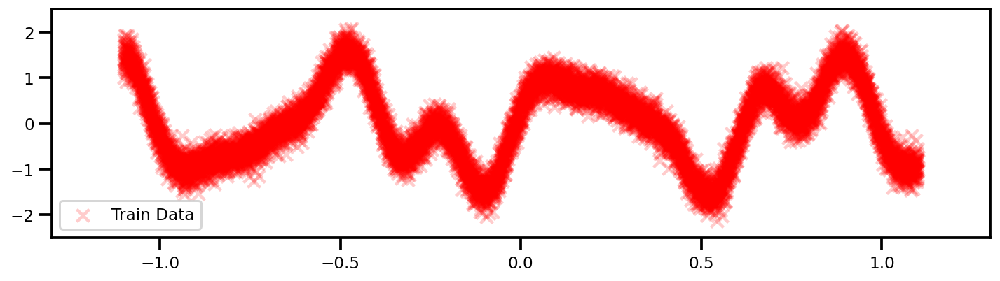
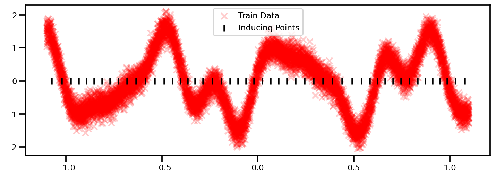
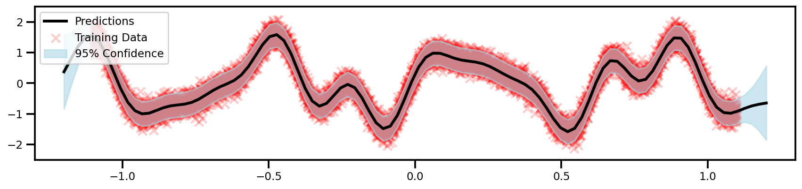
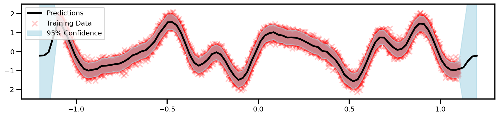

# Large Scale 1D Example Walk-through

!!! info "Colab Notebooks"

    <center>

    |     Name     |                                                                           Colab Notebook                                                                            |
    | :----------: | :-----------------------------------------------------------------------------------------------------------------------------------------------------------------: |
    | scikit-learn | [](https://colab.research.google.com/drive/1vbDP0vtILN6-FLO_kHOyebSMHeOYR5Y1?usp=sharing) |
    |    GPFlow    | [](https://colab.research.google.com/drive/1_ip2kWmp344GC76Dj7IX3vYfTZsz-S-S?usp=sharing) |
    |   GPyTorch   | [](https://colab.research.google.com/drive/15o9-BWW98fP6corLWOew5a0sZq-_3Yvl?usp=sharing) |

    </center>

This demo we will demonstrate how different algorithms compare when

---

## Background

In exact GP estimation, we try to minimize the negative marginal log-likelihood term given by:

$$
\log \mathcal{N}(y | 0, K + \sigma^2I) =
- \frac{1}{2} y^\top\left(  K + \sigma^2I \right)^{-1}y 
- \frac{1}{2}\log \left| K + \sigma^2 \right| - \frac{n}{2}\log 2\pi
$$

So typically any **exact** GP estimation, there will be two expensive parts to this algorithm: $K^{-1}$ and $\log |K|$ which has a computational cost of $\mathcal{O}(N^3)$. **This is bad and very expensive**. Unless you have Google Cloud Platform computational services, you will suffer on a graduate student's laptop. We're talking an upper limit of 10K points if you're willing to be patient.

### Method 1 - Sparse

One thing we can do is to reduce the amount of points that we invert. These representative points are known as **inducing points**. This results in the Nyström approximation which changes our likelihood term from  $\log p(y|X,\theta)$ to:

$$\log \mathcal{N}(y | 0, K + \sigma^2I) \approx \log \mathcal{N}(y | 0, \tilde{K} + \sigma^2I)$$

Notice how we haven't actually changing our formulation because we still have to calculate the inverse of $\tilde{K}$ which is $\mathbb{R}^{N \times N}$. Using the [Woodbury matrix identity](https://en.wikipedia.org/wiki/Woodbury_matrix_identity) for the kernel approximation form ([Sherman-Morrison Formula](https://en.wikipedia.org/wiki/Sherman%E2%80%93Morrison_formula)):

$$(\tilde{K} + \sigma^2 I)^{-1}=\sigma^{-2}I - \sigma^{-4}K_z(K_{zz}+\sigma^{-2}K_z^{\top}K_z)^{-1}K_z^{\top}$$

Now the matrix that we need to invert is $(K_{zz}+\sigma^{-2}K_z^{\top}K_z)^{-1}$ which is $(M \times M)$ which is considerably smaller if $M << N$. So the overall computational complexity reduces from $\mathcal{O}(N^3)$ to $\mathcal{O}(MN^2)$ where $M<<N$ $\mathcal{O}(NM^2)$.

### Method 2 - Black-Box Matrix-Matrix (BBMM)

This uses good ol' matrix multiplication strategies that you saw in your numerical methods class but perhaps never paid attention to. It uses a modified batched version of the conjugate gradients for the most expensive parts of the algorithm. It also uses preconditioning strategies to speed up the convergence. So remember, GPU acceleration is powerful **because** it's comprised of many cores that utilize matrix multiplication. So this is why this is much faster and it scales in the settings of GPUs. So the overall computational complexity reduces from $\mathcal{O}(N^3)$ to $\mathcal{O}(N^2)$.

Below, let's see how these methods do in approximating a 1D dataset in terms of speed.

---

## Data

Let's generate a more complex example which would definitely require more than 25 data points to capture. (OK, Maybe not 10K but enough)...

$$
f(x) = \sin(3\pi x) + \frac{1}{3}\sin(9\pi x) + \frac{1}{2} \sin(7 \pi x)
$$

??? info "Code"

    ```python
    n_samples = 10_000

    def f(x):
        return np.sin(x * 3 * 3.14) + 0.3 * np.cos(x * 9 * 3.14) + 0.5 * np.sin(x * 7 * 3.14)

    X = np.linspace(-1.1, 1.1, n_samples)
    X_plot = np.linspace(- 1.3, 1.3, 100)[:, np.newaxis]
    y =  f(X) + 0.2 * rng.randn(X.shape[0])

    X, y = X[:, np.newaxis], y[:, np.newaxis]
    ```

<center>
**10,000 Data Points!**
{: loading=lazy }
</center>


**Source**: [GPFlow - Big Data Tutorial](https://gpflow.readthedocs.io/en/develop/notebooks/advanced/gps_for_big_data.html)

---

## GP Model

For this example, we'll just show the 3 different methods using the standard `linear` mention function and the `RBF` kernel matrix.. The code will be **very identical**. The only major difference is that the sparse approximations need some inducing points (representative points).

??? code "GPFlow (Exact)"

    ```python
    from gpflow.mean_functions import Linear
    from gpflow.kernels import RBF
    from gpflow.models import GPR

    # define the kernel
    kernel = RBF()

    # define mean function
    mean_f = Linear()

    # define GP Model
    gp_model = GPR(data=(X, y), kernel=kernel, mean_function=mean_f)
    ```


??? code "GPFlow (Sparse)"

    **Kernel & Mean Function**

    ```python
    from gpflow.mean_functions import Linear
    from gpflow.kernels import RBF

    # define the kernel
    kernel = RBF()

    # define mean function
    mean_f = Linear()
    ```


    **Inducing Points**

    ```python
    from sklearn.cluster import KMeans

    n_inducing = 50
    seed = 123

    # KMeans model
    kmeans_clf = KMeans(n_clusters=n_inducing)
    kmeans_clf.fit(X)

    # get cluster centers as inducing points
    Z = kmeans_clf.cluster_centers_
    ```

    <center>
    {: loading=lazy }
    </center>

    **GP Model**

    ```python
    from gpflow.models import SGPR

    # define GP Model
    sgpr_model = SGPR(
        data=(X, y),
        kernel=kernel,
        inducing_variable=Z,
        mean_function=mean_f, 
    )


    # get a nice summary
    print_summary(sgpr_model, )
    ```

    ```bash
    ╒══════════════════════════╤═══════════╤══════════════════╤═════════╤═════════════╤═════════╤═════════╤════════════╕
    │ name                     │ class     │ transform        │ prior   │ trainable   │ shape   │ dtype   │ value      │
    ╞══════════════════════════╪═══════════╪══════════════════╪═════════╪═════════════╪═════════╪═════════╪════════════╡
    │ SGPR.mean_function.A     │ Parameter │ Identity         │         │ True        │ (1, 1)  │ float64 │ [[1.]]     │
    ├──────────────────────────┼───────────┼──────────────────┼─────────┼─────────────┼─────────┼─────────┼────────────┤
    │ SGPR.mean_function.b     │ Parameter │ Identity         │         │ True        │ (1,)    │ float64 │ [0.]       │
    ├──────────────────────────┼───────────┼──────────────────┼─────────┼─────────────┼─────────┼─────────┼────────────┤
    │ SGPR.kernel.variance     │ Parameter │ Softplus         │         │ True        │ ()      │ float64 │ 1.0        │
    ├──────────────────────────┼───────────┼──────────────────┼─────────┼─────────────┼─────────┼─────────┼────────────┤
    │ SGPR.kernel.lengthscales │ Parameter │ Softplus         │         │ True        │ ()      │ float64 │ 1.0        │
    ├──────────────────────────┼───────────┼──────────────────┼─────────┼─────────────┼─────────┼─────────┼────────────┤
    │ SGPR.likelihood.variance │ Parameter │ Softplus + Shift │         │ True        │ ()      │ float64 │ 1.0        │
    ├──────────────────────────┼───────────┼──────────────────┼─────────┼─────────────┼─────────┼─────────┼────────────┤
    │ SGPR.inducing_variable.Z │ Parameter │ Identity         │         │ True        │ (50, 1) │ float64 │ [[0.118... │
    ╘══════════════════════════╧═══════════╧══════════════════╧═════════╧═════════════╧═════════╧═════════╧════════════╛
    ```

    ??? tip "Numpy 2 Tensor"
        Notice how I didn't do anything about changing from the `np.ndarray` to the `tf.tensor`? Well that's because GPFlow is awesome and does it for you. Little things like that make the coding experience so much better.

??? code "GPyTorch (Exact BBMM)"

    !!! warning "Numpy to Tensor"

        Unfortunately, this is one of those things where PyTorch becomes more involved to use. There is no automatic conversion from a `np.ndarray` to a `torch.Tensor`. So in your code bases, you need to ensure that you do this.

        ```python
        # convert to tensor
        X_tensor, y_tensor = torch.Tensor(X.squeeze()), torch.Tensor(y.squeeze())
        ```

    **Define GP Model**

    Again, this is involved. You need to create the GP model exactly how one would think about doing it. You need a mean function, a kernel function, a likelihood and some data. We inherit the `gpytorch.models.ExactGP` class and we're good to go.

    ```python linenums="1"
    # We will use the simplest form of GP model, exact inference
    class GPModel(gpytorch.models.ExactGP):
        def __init__(self, train_x, train_y, likelihood, mean_module, covar_module):
            super().__init__(train_x, train_y, likelihood)
            # Constant Mean function
            self.mean_module = mean_module
            # RBF Kernel Function
            self.covar_module = covar_module

        def forward(self, x):
            mean_x = self.mean_module(x)
            covar_x = self.covar_module(x)
            return gpytorch.distributions.MultivariateNormal(mean_x, covar_x)
    ```

    **Initialize GP model**

    Now that we've defined our GP, we can intialize it with the appropriate parameters - **mean function**, **kernel function** and **likelihood**.

    ```python linenums="1"
    # initialize mean function
    mean_f = gpytorch.means.ConstantMean()

    # initialize kernel function
    kernel = gpytorch.kernels.ScaleKernel(gpytorch.kernels.RBFKernel())

    # intialize the likelihood
    likelihood = gpytorch.likelihoods.GaussianLikelihood()

    # initialize the gp model with the likelihood
    gp_model = GPModel(X_tensor, y_tensor, likelihood, mean_f, kernel)
    ```

    And we're done! So now you noticed that you learned a bit more than necessary to actually understand how the GP works because you had to build it from scratch (to some extent). This can be cumbersome but it might be more useful than the `sklearn` implementation because it gives us a bit more flexibility.

    !!! important "GPU"

        So to get some scaling and faster training, we can use the GPU. For PyTorch, that means converting everything to a Tensor format.

        ```python
        X_tensor = X_tensor.cuda()
        y_tensor = y_tensor.cuda()
        gp_model = gp_model.cuda()
        likelihood = likelihood.cuda()
        ```

---

## Training Step

!!! tip "Training Time"
    <center>


    | GPFlow (Exact) | GPFlow (Sparse) | GPyTorch (Exact) |
    | :------------: | :-------------: | :--------------: |
    |   24 minutes   |  **3 seconds**  |  **30 seconds**  |
    |      GPU       |       GPU       |       GPU        |

    </center>

??? "GPFlow (Exact)"


    ```python

    # define optimizer and params
    opt = gpflow.optimizers.Scipy()
    method = "L-BFGS-B"
    n_iters = 100

    # optimize
    opt_logs = opt.minimize(
        gp_model.training_loss,
        gp_model.trainable_variables, 
        options=dict(maxiter=n_iters),
        method=method,
    )

    # print a summary of the results
    print_summary(gp_model)
    ```


    ```bash
    ╒═════════════════════════╤═══════════╤══════════════════╤═════════╤═════════════╤═════════╤═════════╤═════════════════════╕
    │ name                    │ class     │ transform        │ prior   │ trainable   │ shape   │ dtype   │ value               │
    ╞═════════════════════════╪═══════════╪══════════════════╪═════════╪═════════════╪═════════╪═════════╪═════════════════════╡
    │ GPR.mean_function.A     │ Parameter │ Identity         │         │ True        │ (1, 1)  │ float64 │ [[-0.109]]          │
    ├─────────────────────────┼───────────┼──────────────────┼─────────┼─────────────┼─────────┼─────────┼─────────────────────┤
    │ GPR.mean_function.b     │ Parameter │ Identity         │         │ True        │ (1,)    │ float64 │ [-0.027]            │
    ├─────────────────────────┼───────────┼──────────────────┼─────────┼─────────────┼─────────┼─────────┼─────────────────────┤
    │ GPR.kernel.variance     │ Parameter │ Softplus         │         │ True        │ ()      │ float64 │ 1.4583605690651238  │
    ├─────────────────────────┼───────────┼──────────────────┼─────────┼─────────────┼─────────┼─────────┼─────────────────────┤
    │ GPR.kernel.lengthscales │ Parameter │ Softplus         │         │ True        │ ()      │ float64 │ 0.10119699753609418 │
    ├─────────────────────────┼───────────┼──────────────────┼─────────┼─────────────┼─────────┼─────────┼─────────────────────┤
    │ GPR.likelihood.variance │ Parameter │ Softplus + Shift │         │ True        │ ()      │ float64 │ 0.03981121449717302 │
    ╘═════════════════════════╧═══════════╧══════════════════╧═════════╧═════════════╧═════════╧═════════╧═════════════════════╛
    CPU times: user 13min 42s, sys: 9min 57s, total: 23min 40s
    Wall time: 24min 43s
    ```

??? "GPFlow (Sparse)"

    ```python
    # define optimizer and params
    minibatch_size = 128

    # turn of training for inducing points
    opt = gpflow.optimizers.Scipy()

    # training loss
    training_loss = sgpr_model.training_loss_closure()
    method = "L-BFGS-B"
    n_iters = 1_000

    # optimize
    opt_logs = opt.minimize(
        sgpr_model.training_loss,
        sgpr_model.trainable_variables, 
        options=dict(maxiter=n_iters),
        method=method,
    )

    # print a summary of the results
    print_summary(sgpr_model)
    ```

    ```bash
    ╒══════════════════════════╤═══════════╤══════════════════╤═════════╤═════════════╤═════════╤═════════╤═════════════════════╕
    │ name                     │ class     │ transform        │ prior   │ trainable   │ shape   │ dtype   │ value               │
    ╞══════════════════════════╪═══════════╪══════════════════╪═════════╪═════════════╪═════════╪═════════╪═════════════════════╡
    │ SGPR.mean_function.A     │ Parameter │ Identity         │         │ True        │ (1, 1)  │ float64 │ [[-0.111]]          │
    ├──────────────────────────┼───────────┼──────────────────┼─────────┼─────────────┼─────────┼─────────┼─────────────────────┤
    │ SGPR.mean_function.b     │ Parameter │ Identity         │         │ True        │ (1,)    │ float64 │ [-0.027]            │
    ├──────────────────────────┼───────────┼──────────────────┼─────────┼─────────────┼─────────┼─────────┼─────────────────────┤
    │ SGPR.kernel.variance     │ Parameter │ Softplus         │         │ True        │ ()      │ float64 │ 1.4608235231409987  │
    ├──────────────────────────┼───────────┼──────────────────┼─────────┼─────────────┼─────────┼─────────┼─────────────────────┤
    │ SGPR.kernel.lengthscales │ Parameter │ Softplus         │         │ True        │ ()      │ float64 │ 0.10123051205205866 │
    ├──────────────────────────┼───────────┼──────────────────┼─────────┼─────────────┼─────────┼─────────┼─────────────────────┤
    │ SGPR.likelihood.variance │ Parameter │ Softplus + Shift │         │ True        │ ()      │ float64 │ 0.03980796876613383 │
    ├──────────────────────────┼───────────┼──────────────────┼─────────┼─────────────┼─────────┼─────────┼─────────────────────┤
    │ SGPR.inducing_variable.Z │ Parameter │ Identity         │         │ True        │ (50, 1) │ float64 │ [[0.107...          │
    ╘══════════════════════════╧═══════════╧══════════════════╧═════════╧═════════════╧═════════╧═════════╧═════════════════════╛
    CPU times: user 2.01 s, sys: 196 ms, total: 2.21 s
    Wall time: 2.24 s══════════╧═════════╧═════════════╧═════════╧═════════╧═════════════════════╛
    ```

??? "GPyTorch (Exact BBMM)"

    !!! tip "Same as small data"
        So this code is actually the same as the small data [1D Example](,/../1d_example.md)! We just have to change it to use the GPU and we're good to go!

    So admittedly, this is where we start to enter into boilerplate code because this is stuff that needs to be done almost always.

    **Set Model and Likelihood in Training Mode**

    For this step, we need to let PyTorch know that we want all of the `layers` inside of our class primed and ready in train mode. 
    
    ??? info "Note" 
        This is mostly from things like BatchNormalization and DropOut which tend to behave differently between train and test. But we inherited the commands.

    ```python
    # set model and likelihood in train mode
    likelihood.train()
    gp_model.train()
    ```
    One nice thing is that it will give you a small overview of how the model looks as a tuple of tuples.

    ```bash
    GPModel(
    (likelihood): GaussianLikelihood(
        (noise_covar): HomoskedasticNoise(
        (raw_noise_constraint): GreaterThan(1.000E-04)
        )
    )
    (mean_module): ConstantMean()
    (covar_module): ScaleKernel(
        (base_kernel): RBFKernel(
        (raw_lengthscale_constraint): Positive()
        )
        (raw_outputscale_constraint): Positive()
    )
    )
    ```

    **Choose Optimizer and Loss**

    Now we define the optimizer as well as the loss function.

    ```python linenums="1"
    # optimizer setup
    lr = 0.1

    # Use the adam optimizer
    optimizer = torch.optim.Adam(
        gp_model.parameters(), lr=lr
    ) 

    # Loss Function - the marginal log likelihood
    mll = gpytorch.mlls.ExactMarginalLogLikelihood(likelihood, gp_model)
    ```

    **Training**

    And now we can finally train our model! Now, all of this that comes after is boilerplate code. We have to do it almost every time when using PyTorch. No escaping unless you want to use another package (which you should; I'll demonstrate that in a later tutorial).

    ```python linenums="1"
    # choose iterations
    n_epochs = 100

    # initialize progressbar
    with tqdm.notebook.trange(n_epochs) as pbar:
        for i in pbar:
            # Zero gradients from previous iteration
            optimizer.zero_grad()

            # Output from model
            output = gp_model(X_tensor)
            # Calc loss
            loss = -mll(output, y_tensor)

            # backprop gradients
            loss.backward()

            # get parameters we want to track
            postfix = dict(
                Loss=loss.item(),
                scale=gp_model.covar_module.outputscale.item(),
                length_scale=gp_model.covar_module.base_kernel.lengthscale.item(),
                noise=gp_model.likelihood.noise.item()
                )
            
            # step forward in the optimization
            optimizer.step()

            # update the progress bar
            pbar.set_postfix(postfix)
    ``` 

---

## Predictions

??? code "GPFlow (Exact)"

    ```python
    # generate some points for plotting
    X_plot = np.linspace(-3*np.pi, 3*np.pi, 100)[:, np.newaxis]

    # predictive mean and standard deviation
    y_mean, y_var = gp_model.predict_y(X_plot)

    # convert to numpy arrays
    y_mean, y_var = y_mean.numpy(), y_var.numpy()

    # confidence intervals
    y_upper = y_mean + 2* np.sqrt(y_var)
    y_lower = y_mean - 2* np.sqrt(y_var)
    ```

    ??? tip "Tensor 2 Numpy"
        So we do have to convert to numpy arrays from tensors for the predictions. Note, you can plot tensors, but some of the commands might be different.

        E.g. 

        ```python
        y_upper = tf.squeeze(y_mean + 2 * tf.sqrt(y_var))
        ```


??? code "GPFlow (Sparse)"

    ```python
    # generate some points for plotting
    X_plot = np.linspace(-1.2, 1.2, 100)[:, np.newaxis]

    # predictive mean and standard deviation
    y_mean, y_var = sgpr_model.predict_y(X_plot)


    # convert to numpy arrays
    y_mean, y_var = y_mean.numpy(), y_var.numpy()

    # confidence intervals
    y_upper = y_mean + 2* np.sqrt(y_var)
    y_lower = y_mean - 2* np.sqrt(y_var)

    # Get learned inducing points
    Z = sgpr_model.inducing_variable.Z.numpy()
    ```

    ??? tip "Tensor 2 Numpy"
        So we do have to convert to numpy arrays from tensors for the predictions. Note, you can plot tensors, but some of the commands might be different.

        E.g. 

        ```python
        y_upper = tf.squeeze(y_mean + 2 * tf.sqrt(y_var))
        ```

??? code "GPyTorch (Exact BBMM)"

    !!! tip "Same as small data"
            Again, this code is actually the same as the small data [1D Example](,/../1d_example.md)! We just have to port our input data to the GPU (always)!

    We're still now out of it yet. We still need to do a few extra stuff to get predictions. Here we can simply

    **Eval Mode**

    We need to put our model back in `.eval` mode. This will allow all layers to behave in eval mode.

    ```python
    # put the model in eval mode
    gp_model.eval()
    likelihood.eval()
    ```

    One nice thing is that the resulting `observed_pred` is actually a class with a few methods and properties, e.g. `mean`, `variance`, `confidence_region`. Very convenient for predictions.

    ```python linenums="1"
    # generate some points for plotting
    X_plot = np.linspace(-3*np.pi, 3*np.pi, 100)[:, np.newaxis]

    # convert to tensor
    X_plot_tensor = torch.Tensor(X_plot)


    # turn off the gradient-tracking
    with torch.no_grad():

        # generate data
        X_plot_tensor = torch.linspace(-3*np.pi, 3*np.pi, 100)

        # convert tensor to CUDA
        X_plot_tensor = X_plot_tensor.cuda()

        # get predictions
        observed_pred = likelihood(gp_model(X_plot_tensor))

        # extract mean prediction
        y_mean_tensor = observed_pred.mean

        # extract confidence intervals
        y_upper_tensor, y_lower_tensor = observed_pred.confidence_region()
    ```

    And yes...we still have to convert our data to `np.ndarray`.
    ```python
    # convert to numpy array
    X_plot = X_plot_tensor.numpy()
    y_mean = y_mean_tensor.numpy()
    y_upper = y_upper_tensor.numpy()
    y_lower = y_lower_tensor.numpy()
    ```

---

## Visualization


??? info "Plot Function"

    It's the same for all libraries as I first convert everything to numpy arrays and then plot the results.

    ```python
    fig, ax = plt.subplots(figsize=(12, 4))

    ax.scatter(
        X, y, 
        label="Training Data",
        color='Red',
        marker='x',
        alpha=0.2
    )

    ax.plot(
        X_plot, y_mean, 
        color='black', lw=3, label='Predictions'
    )
    plt.fill_between(
        X_plot.squeeze(), 
        y_upper.squeeze(), 
        y_lower.squeeze(), 
        color='lightblue', alpha=0.6,
        label='95% Confidence'
    )
    plt.scatter(
        Z, np.zeros_like(Z), 
        color="black", marker="|", 
        label="Inducing locations"
    )
    ax.legend()
    plt.tight_layout()
    plt.show()
    ```

=== "GPFlow (Exact)"

    <center>
    
    </center>


=== "GPFlow (Sparse)"

    <center>
    
    </center>

=== "GPyTorch (Exact BBMM)"

    <center>
    
    </center>