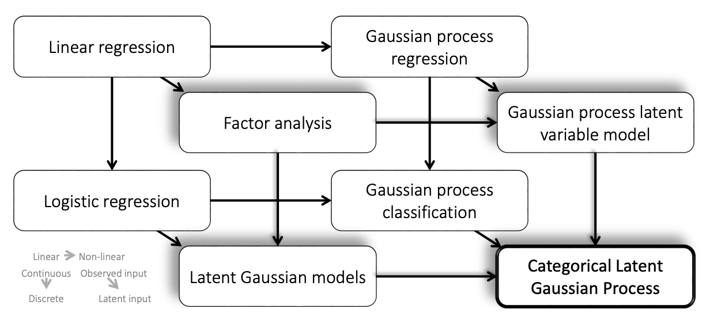

## Algorithms

---
### Latent Variable Models

  

**Figure**: (Gal et. al., 2015)

1. Latent Gaussian Processes for Distribution Estimation of Multivariate Categorical Data - Gal et. al. (2015) - [Resources](http://www.cs.ox.ac.uk/people/yarin.gal/website/publications.html#Gal2015Latent)

