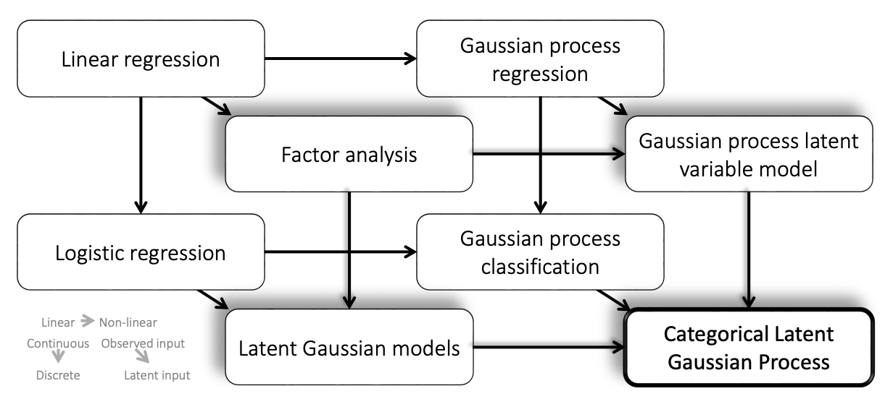

# Gaussian Processes

## Best Resources

These are the best resources to use

* [A Visual Exploration of Gaussian Processes](https://distill.pub/2019/visual-exploration-gaussian-processes/) - Görtler et al. (2019)
* Neil Lawrence Lecture @ MLSS 2019
    * [Blog](http://inverseprobability.com/talks/notes/gaussian-processes.html) | [Lecture](http://inverseprobability.com/talks/notes/gaussian-processes.html) | [Slides](http://inverseprobability.com/talks/notes/gaussian-processes.html)
* Foundations of Machine Learning: GPs - Deisenroth (2018-2019)
    * [Slides](https://deisenroth.co.uk/teaching/2018-19/foundations-of-machine-learning/lecture_gaussian_processes.pdf) 
    * [A Practical Guide to GPs](https://drafts.distill.pub/gp/)

### Other Resources

#### Standard Book

[Gaussian Processes for Machine Learning](http://www.gaussianprocess.org/gpml/) - Rasmussen (2006)

This is the standard book that everyone recommends. It gives a fantastic overview with a few different approaches to explaining. However, for details about the more mathy bits, it may not be the best.

### Better Books

[Pattern Recognition and Machine Learning](https://www.microsoft.com/en-us/research/publication/pattern-recognition-machine-learning/) - Murphy (2006)

A much better book which highlights a lot of the mathy bits (e.g. being able to fully manipulate joint Gaussian distributions to arrive at the GP).

#### Previously Compiled Stuff

So I found a few resources that give papers as well as some codes and lectures that you can look at.

* Into to GPs - [Super Compilation](https://ebonilla.github.io/gaussianprocesses/)
* Deep GPs Nonparametric - [Papers](https://github.com/otokonoko8/deep-Bayesian-nonparametrics-papers/blob/master/README.md)
* GPs for Dynamical System Modeling - [Papers](http://dsc.ijs.si/jus.kocijan/GPdyn/)

---
## Algorithms

### Sparse Spectrum Gaussian Processes

These are essentially the analogue to the random fourier features for Gaussian processes.

#### SSGP

1. Sparse Spectrum Gaussian Process Regression - Lázaro-Gredilla et. al. (2010) - [PDF](http://jmlr.csail.mit.edu/papers/v11/lazaro-gredilla10a.html)
   > The original algorithm for SSGP.
2. Prediction under Uncertainty in Sparse Spectrum Gaussian Processes
with Applications to Filtering and Control - Pan et. al. (2017) - [PDF](http://proceedings.mlr.press/v70/pan17a.html)
    > This is a moment matching extension to deal with the uncertainty in the inputs at prediction time.

* Python Implementation
  * [Numpy](https://github.com/marcpalaci689/SSGPR)
  * [GPFlow](https://github.com/jameshensman/VFF/blob/master/VFF/ssgp.py)

#### Variational SSGPs

So according to [this paper]() the SSGP algorithm had a tendency to overfit. So they added some additional parameters to account for the noise in the inputs making the marginal likelihood term intractable. They added variational methods to deal with the 
1. Improving the Gaussian Process Sparse Spectrum Approximation by Representing Uncertainty in Frequency Inputs - Gal et. al. (2015) 
   > "...proposed variational inference in a sparse spectrum model that is derived from a GP model." - Hensman et. al. (2018)
2. Variational Fourier Features for Gaussian Processes -  Hensman et al (2018)  
   > "...our work aims to directly approximate the posterior of the true models using a variational representation." - Hensman et. al. (2018)

* Yarin Gal's Stuff - [website](http://www.cs.ox.ac.uk/people/yarin.gal/website/publications.html#Gal2015Improving)
* Code
  * [Numpy](https://github.com/marcpalaci689/SSGPR)
  * [Theano](https://github.com/yaringal/VSSGP)

---
### Latent Variable Models

  

**Figure**: (Gal et. al., 2015)

1. Latent Gaussian Processes for Distribution Estimation of Multivariate Categorical Data - Gal et. al. (2015) - [Resources](http://www.cs.ox.ac.uk/people/yarin.gal/website/publications.html#Gal2015Latent)

